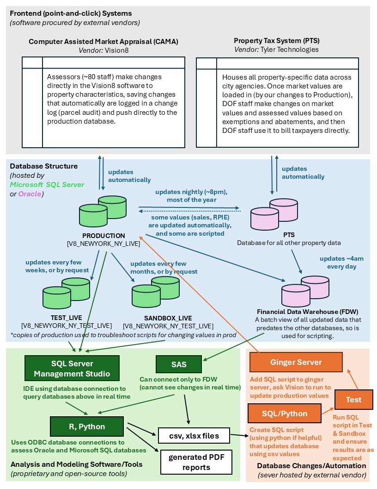

# Database Connections through R

The DOF Property Modeling Team utilizes a range of databases and tools to store and analyze data.

The diagram below gives a high-level overview of how these different data resources and tools are used together.



## How can you access these data resources in R?

There are currently two different ways to connect to our databases through R: creating a Microsoft SQL Server database connection (for the Production, Test, and Sandbox Databases) and using a custom database connection through our custom package assessNYC (for Financial Data Warehouse and Property Tax System).

### Connecting with Microsoft SQL Server

We can establish a direct connection to Microsoft SQL Server using existing R packages, which link to the database using our credentials, allowing us to query the Production, Test, and Sandbox databases.

To do this, you first need to import two R packages locally: `DBI` and `odbc`. Note: you only need to do this once.

``` r
#install necessary packages
install.packages("DBI")
install.packages("odbc")
```

Once these two packages are installed, you can establish a database connection using the credentials for either the production, test, or sandbox databases. For this demonstration, I'll query the test database, so first I'll save those credentials locally to my `.Renviron` file.

``` r
#replace the following with the real credentials
test_server="XXX.XXX.XX.XXX"
test_database='V8_XXXXXXXXXXXXXXXXXXX'
test_username="XXXXX"
test_password="XXXXX"
```

After starting a new R session. I can make sure that those credentials are being read in as environmental variables by doing the following:

```
Sys.getenv("test_server")
```

Next, I'll use the DBI and odbc packages to create a connection to the Microsoft SQL Server database as follows:

``` r
# load necessary packages
library(DBI)
library(odbc)

# create database connection
con <- DBI::dbConnect(odbc::odbc(),
                      Driver   = "SQL Server",
                      Server   = Sys.getenv("test_server"),
                      Database = Sys.getenv("test_database"),
                      UID      = Sys.getenv("test_username"),
                      PWD      = Sys.getenv("test_password"),
                      TrustServerCertificate="yes",
                      Port     = 1433)
```

After establishing your connection in RStudio, you can browse the tables and schemas in the "Connections" tab on the right side of your screen, next to the "Environment" tab. This provides the same functionality as SQL Server.

With the database connection in place, we can begin constructing our queries. Let's start with a basic one.

``` r
query="SELECT TOP 100 * FROM REAL_PROP.REALMAST"
```

Now that we have saved the query as a string, we can use it to query the database and store the result as a dataframe in our local R environment. To do this, we need to use the `dbGetQuery()` function, providing the database connection and the query string we wish to execute.

``` r
realmast_top100 <- DBI::dbGetQuery(
    #connection object made above
    conn=con,
    #pass the query we made above into the statement parameter
    statement=query
)
```

Let's take a look at the results:

``` r
head(realmast_top100)
```

Great! Now let's try a slightly more complicated query using some environmental variables.

The package glue is helpful to drop in variables within a string (like a fiscal year or BCAT) using curly brackets, making it a more legible query than using paste().

``` r
library(glue)

prior_FY=2025

incdata_query =
    glue::glue("
    Select ILA_Pid as Pid,
        ILA_AGI as AGI,
        ILA_AGI_PGSF as Inc_PGSF,
        ILA_Adj_Exp as AdjExp,
        ILA_Adj_Exp_PGSF as Exp_PGSF,
        ILA_Adj_EXP_PGI as ExpRatio,
        ILA_Adj_NOI as NOI,
        ILA_ADJ_NOI_PGSF as NOI_Pgsf,
        ILA_Tot_cap_rate as TotCap,
        ILA_Inc_Val as FY26_MV,
        ILA_Tot_Val as Tot_Val,
        ILF_BLDG_CAT as BCAT,
        ILF_Bldg_Sub_Cat as Subcat
    From 
        Real_Prop.INCOME_LF_APPROACH, 
        Real_Prop.Income_LF
    Where ILA_Type='R' And ILA_Year={prior_FY} 
        and ilf_year={prior_FY} and ilf_pid=ila_pid
    ")
```

We can check if it included our variables correctly by printing it:

``` r
print(incdata_query)
```

Great! Now let's query our test database for this income data.

``` r
income <- DBI::dbGetQuery(
    #same connection object made above
    conn=con,
    #pass the new query
    statement=incdata_query
)
```

Let's take a look at the results:

``` r
head(income)
```

Now we can analyze the data easily within R and re-run the same import script without needing to handle any CSVs.

Once you are done reading in data, you can close your database connection by doing the following:

``` r
DBI::dbDisconnect(con)
```

You can also do this by going up to the connections panel on the top right corner of RStudio and clicking the icon of the pipe with the red x through it.

### Connecting with Financial Data Warehouse

Next, we can read in data from the Financial Data Warehouse (FDW) using a custom function `get_database_table` built for this team within the assessNYC package.

First, follow [these instructions](https://github.com/nycdepartmentoffinance/assessNYC) to install the package.

Once installed, you can explore some of the documentation of this function:

``` r
?assessNYC::get_database_table()
```

The function works similarly to the previous one, taking parameters to build the correct query and establish the appropriate database connection.

To query the right database, you need to:

-   indicate the database (either "FDW" or "PTS"),

-   name the result of our dataframe as "tablename" (NOTE: this is not the actual name of the tables we are pulling from), and

-   pass it a query string (just like in the previous example).

Since the database connection is made in SAS, two additional parameters are required:

-   `sas_filepath`: file path to your SAS executable (`sas.exe`)

-   `env_filepath`: file path to an environmental file that has the following saves as variables: `fdw_username`, `fdw_password`, `fdw_path`, `fdw_schema` and/or `pts_username`, `pts_password`, `pts_path`, `pts_schema`

With that in mind, let's replicate the top 100 realmast query from above, but instead of using the test database use FDW instead.

All together, the call to FDW using the get_database_table function would be the following:

``` r
realmast_top100_fdw = assessNYC::get_database_table(
     database='FDW',
     tablename='realmast_top100_fdw',
     query="
        Select *
        From S.vw_Cama_realmast(obs=100);
        ",
     # these two inputs are specific to my system. Make sure to change as needed
     sas_filepath='C:/Program Files/SASHome/SASFoundation/9.4/sas.exe',
     env_filepath='C:/Users/BoydClaire/workspace_local/.renviron'
      )
```

Let's check the results:

``` r
head(realmast_top100_fdw)
```

Great! This looks very similar to our call to the test database. Now we can pretty much interchangeably get data into R from either database resource and analyze it as needed all in once place.

**Note:** if the FDW call fails, look within the `tmp/` folder in your current working directory at the log for the given call. You should be able to debug it from there.
