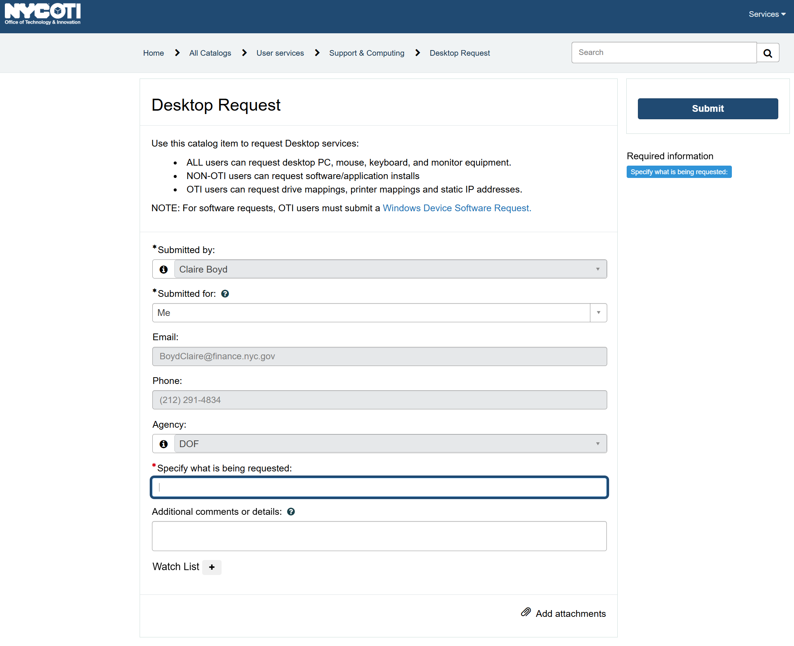

# Getting Started in Python

This guide is intended to help you get oriented how to get python set up on your city machine and where to go for additional training resources, regardless of your prior programming experience.

**Note**: Unlike the R guide, this guide doesn't have much on the mechanics of how to use python itself. Instead of re-inventing the wheel here, I highly recommend the resources linked in the **Learning the basics of Python** section below. 

## Getting set up

In order to start programming in R on your own, you need a few pieces of software installed on your machine. To get started, submit a [HelpDesk ticket](https://cwitservice.nyc.gov/sp) to download both **python** and **VSCode**:

- **python** is the programming language itself. It contains all the tools needed to perform calculations, manipulate data, and build models. 

- **VSCode** is one of the Integrated Development Environment (IDE) options for python. It is just one of the options for most easily programming in python. It will allow you to toggle between scripts, query databases directly, and more. We recommend using VSCode instead of Jupyter or other IDEs because we have found it easier to configure the proxy settings with VSCode (which is outlined in the [next guide](proxy_python.md)).

Navigate to a desktop request by clicking on `Request something new` and then `Desktop Request`. Your screen should look like the following:



Under `Specify what is being requested`, include the following:
```
I need to install the latest version of python (https://www.python.org/downloads/) and VSCode (https://code.visualstudio.com/) on my local machine. Thank you!
```

Press `Submit`. This might take a few days, but IT should get back to you shortly.

## Learning the Basics of Python

While you wait for your software to be installed on your machine, you can start getting up to speed with how python works and how to use it.

### LinkedIn Learning

As of 1/2026, all DOF employees have access to LinkedIn Learning resources via an agency-wide license. To get set-up with LinkedIn Learning, do the following:
- Go to https://www.linkedin.com/learning and sign in with your DOF email
- Once you are signed in, you should be able to access [Introduction to Python Programming](https://www.linkedin.com/learning/collections/7424572357882834945?u=2208145), a collection of trainings that I picked out that I think are the most helpful. I'd recommend the following trainings (more or less in this order, if you are new to git/github):
    - Python for Non-Programmers (beginner)
    - Python Data Analysis (beginner)
    - Complete Guide to Python for Data Engineering: From Beginner to Advanced (intermediate)
    - Advanced Python: Working with Databases (intermediate)

### Additional Resources

The following trainings/resources have been recommended by python users across other city government agencies:
- [Automate the Boring Stuff with Python](https://inventwithpython.com/automate3workbook/introduction.html): Self-guided book, with accessible language and clear examples. This resource covers the basics of python in general, not necessarily narrowed to data analysis but is really helpful when getting started nonetheless.
- [Introduction to Python for Geographic Data Analysis](https://pythongis.org/): This guide will orient you to python for the purposes of data analysis, with special attention to using python for GIS.
- [Advent of Code](https://adventofcode.com/): This resource is less for instruction and more for practice. After getting a sense of the fundamentals, you can directly apply those skills to these daily puzzles that come out in December each year - getting harder as the month progresses.