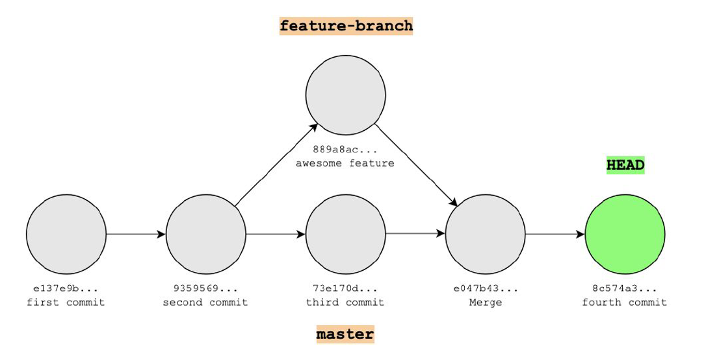

# GitHub Workflow

When working on data projects (both on your own and with others) it’s helpful to to have a way to break work into clear tasks and test changes without affecting the main version. Using tools that let you work on your own copy of a project—and connect that work to a specific task—helps teams stay organized, avoid conflicts, and make confident updates.

Git provides a few simple but powerful tools to support this kind of workflow: _branches_, _issues_, and _pull requests_.

This guide walks you through these core features of git, covering:

1. **What a branch is** — and why working in your own space matters

2. **How to create and use a branch** — without disrupting others

3. **What an issue is** — and how to use them to define and track tasks

4. **How to branch based on an issue** — for clear, focused progress

5. **What a pull request is** — and how it brings everything together for review

6. **How to open a pull request** — and how to use it to merge work into the main branch of the project

For more visual descriptions of this process, explore the resources from sessions at the [Analytics Exchange Learning Summit 2021](https://cityshare.nycnet/content/anex/pages/anex-learning-summit-2021):

- *Git With It:* Introduction to Git and GitHub
- *GitHub 102:* Working as a collaborative team on GitHub

*Note: the Anex link only works on city machines because it is on an internally hosted site.*


## Branches

Imagine you're working on a new draft of an existing word document. Instead of editing the original directly, you make a copy, work on your version, and only bring it back when it's complete. You might want to do this if you want to make sure that you can go back to the old version if you decide you don't like your changes or want to keep components of the old version as it is.

This instinct to start working on another version of a document and leave a stable version of the project behind is exactly what git branching allows you to do with code.

A **branch** is like a separate workspace or copy of your project. You can make changes there without affecting the main version. Once your changes are ready, you can merge your branch back into the main branch of the project so that your changes are reflected.

The diagram below illustrates Git's branching and merging workflow, which allows teams to work on the same project simultaneously without conflicts.

- The bottom timeline shows the **main/master branch** - the main, stable version of the project that progresses chronologically through various commits (gray circles). Each commit represents a saved snapshot of the project, and the green circle labeled "HEAD" shows the current state after all work has been integrated.

- The **feature branch** at the top demonstrates how developers create their own workspace to develop new functionality safely. This branch splits off from the master branch and contains one commit for the "awesome feature." Importantly, while this feature was being developed in isolation, the main/master branch continued evolving with additional commits (like the "third commit"), showing how parallel development prevents teams from blocking each other's progress.

- The **merge** process, shown by the arrow and special "Merge" commit, integrates the feature branch work back into the main timeline. This merge commit combines the isolated feature development with the ongoing master branch changes, creating a unified project history. The result preserves both the new feature and any parallel work that occurred, while maintaining a complete record of when features were created, developed, and successfully integrated into the main codebase.



**Try it: Create a Branch**

Here's how to create a branch using the command line:

**_Step 1:_** Make sure you're on the main branch and up-to-date

```bash
git checkout main
git pull origin main
```

**_Step 2:_** Create and switch to your new branch

```bash
git checkout -b my-branch-name
```

**_Step 3:_** Push your branch to GitHub so anyone can see it

```bash
git push -u origin my-branch-name
```

**What Should You Branch For?**

You should create a branch whenever you need to work on something specific without affecting the stable version of the project that others (or future you) might depend on. This includes adding new features, fixing problems, or experimenting with different approaches.

The key is that each branch should focus on one clear task - don't try to fix multiple unrelated problems in the same branch. Think of it as having a dedicated workspace for each project, which keeps your work organized and makes it easy for others to understand and review your changes.

But how do you decide what deserves its own branch? This is where **issues** become essential.

## Issues

An **issue** is basically a structured to-do list item that clearly describes what needs to be done. Instead of just thinking "fix the dashboard," you create an issue that spells out the specific problem, why it needs to be fixed, and what the solution might look like.

Each issue then becomes the blueprint for a branch - you create a branch specifically to solve that issue, making the connection between the problem and the solution clear for everyone. This approach transforms vague tasks into focused, trackable work that your whole team can follow and contribute to.

**How "big" should an issue be?**

Issues can vary dramatically in size and scope. You might create an issue to "change this chart color from red to blue" or a much larger one to "figure out how to scale our model to cover three additional boroughs." An issue should be a discrete, well-defined unit of work that typically takes no more than a week.

If a task is too big (e.g. scaling a model to other boroughs), it's perfectly valid to create an issue just to scope out and break down a big project into smaller, manageable pieces. For example: figuring out what parts of the project can be functionalized, and then create issues to functionalize each part of the process.

Good issues follow a simple structure: start with a descriptive title that summarizes the problem concisely, then provide a description with context about what you hope the issue will address (with as much context as you can even if it feels incomplete). The ultimate goal is to make the task clear enough that anyone on your team could pick up the issue and understand exactly what needs to be accomplished. That said, start small to get in the hang of it.

For example, this is [an issue](https://github.com/nycdepartmentoffinance/onboarding/issues/26) of a another guide that our team wants to write. It has a simple title and within the body of the issue it has a rough outline of some of the topics we are thinking of covering.

**Try it: Create an issue**

Follow these steps to open a new issue in any repo where you have access:

1. **Go to the repository**  
   Navigate to the main page of the GitHub repo where you want to open the issue.

2. **Click the “Issues” tab**  
   At the top of the repo, click on the **Issues** tab (next to “Code” and “Pull requests”).

3. **Click “New issue”**  
   In the top-right corner of the Issues page, click the green **“New issue”** button.

4. **Fill out the issue details**

   - **Title**: Write a clear, short summary of the issue
   - **Description**: Provide context—what's happening, what should happen, any steps to reproduce, screenshots, or links
   - **Labels (optional)**: Tag the issue (e.g., `bug`, `enhancement`, `question`) to help categorize
   - **Assignees (optional)**: Assign the issue to yourself or a teammate

5. **Submit the issue**  
   Click **“Submit new issue”** to save and post it to the repository.

**Creating a branch based on an issue**

When you create a branch based on an issue, everyone on your team can instantly see what you're working on and why it matters - no more guessing what "sarah-updates" or "temp-fix" branches are for. Your work stays organized because each branch has a clear purpose tied to a specific problem that needs solving, making it much easier to track progress and avoid getting sidetracked. Best of all, when you're done, the connection between the problem (issue) and solution (branch) creates a complete story that helps your team learn from each other and avoid repeating the same problems.

Creating a branch based on an issue using the point-and-click interface on GitHub is really simple:

1. **Go to your issue** – Open [Issue #26: "virtual env guide"](https://github.com/nycdepartmentoffinance/onboarding/issues/26)

2. **Look for "Create a branch"** – On the right side of the issue page, find the **Development** section and click **"Create a branch"**

3. **Click and customize** – GitHub will suggest a name like `26-virtual-env-guide`. You can rename it to something you prefer, or keep the default name.

4. **Create the branch** – Click **"Create branch"** so that GitHub creates a copy of your project and names it accordingly.

5. **Checkout the branch locally** – Once you create the branch, GitHub will tell you how to checkout the branch on your local machine. First, you would need to navigate to the local version of the repository on your machine in a terminal. In this case, to start working on the branch you just created, you would type in the following:
   ```
   git fetch origin
   git checkout 26-virtual-env-guide
   ```

**Work in the branch**

Once your branch is created, do the work described in the issue:

- Write or update code
- Clean data or adjust queries
- Add tests, comments, or documentation

As you work, make regular commits to save your progress.

```bash
# Save your changes and describe them
git add .
git commit -m "Fix test command error on Windows"
```

Once you have completed the task outlined in the issue or are ready for someone else to review your code or collaborate with you on the task, it's time to open a pull request.

## Pull Request

A **pull request** (often called a “PR”) is how you ask to merge your changes from your branch into the main project. It’s like saying, _“I’ve finished this piece of work—can someone take a look and make sure it’s good to go before merging back with the main project?”_

Behind the scenes, a pull request compares the work you did on your branch to the current version of the `main` branch. It shows exactly what you changed, and gives your teammates a chance to:

- Review the code or content
- Ask questions or suggest edits
- Confirm that everything works as expected

This is a critical quality-check step. It keeps the project stable, encourages collaboration, and helps everyone stay informed about changes before they go live.

### How to open a pull request:

1. When you’re done working on your branch, go to the repository
2. GitHub will often show a **“Compare & pull request”** button at the top—click it  
   _Or:_ go to the **Pull requests** tab and click **“New pull request”**
3. Choose your branch as the “compare” branch, and `main` as the “base” branch
4. Fill out:
   - **Title**: Match the issue or describe the change
   - **Description**: What did you do? Why? Anything reviewers should know?
   - Add reviewers or tags as needed
5. Click **“Create pull request”**

Now your work is up for review and can be discussed, tested, and ultimately merged into the main codebase.

### Merge to main

Once the code changes are reviewed and everything is good to merge back into the `main` branch of the project, you can click on the **“Merge”** button on the pull request screen.

After this completes, there will be an option to close the branch. This is helpful because it does a few things:

- **closes the branch** of work that have already been incorporated into the main project version so are no longer needed (are just extra copies of the project that are not being worked on)
- **marks the issue(s) that is linked to the branch as "Closed"**, so that your progress on the to-do task item of the issue is tracked and marked as completed in your workflow.

Congrats! You have now mastered the GitHub workflow!
