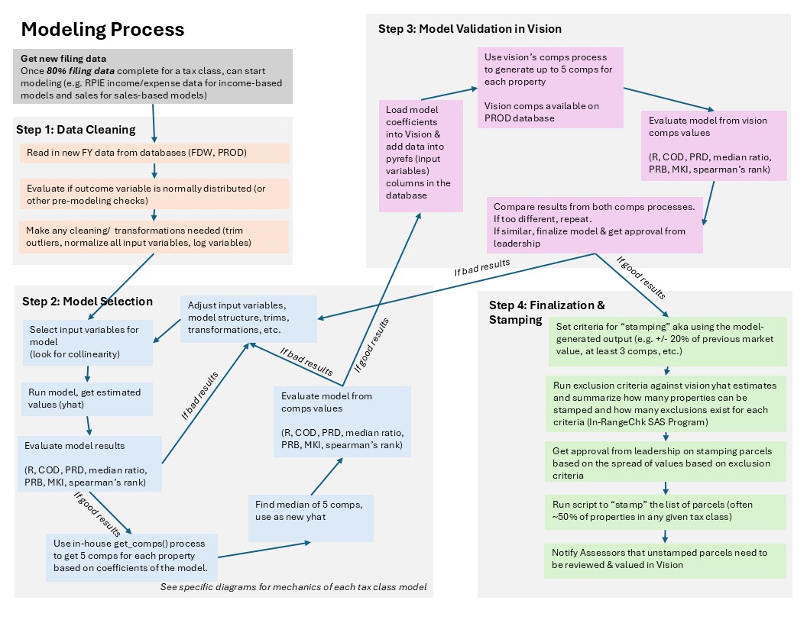

# Property Modeling Overview

The property modeling and valuation team at DOF is responsible for modeling the property value of all \~1M residential and commercial properties in the city every year in order to tax the property owners equitably, as property taxes raise \~40% of the city's annual budget .

### Introductory Resources

For a more detailed overview of the property modeling process, here are a few resources that might help you orient to the work our team does:

-   [Introduction to Property Valuation and Modeling](resources/introduction_pvm_2022.pdf): This powerpoint gives a high level overview of the purpose/scope of property modeling in NYC (first \~25 slides)

-   [Tax and Assessed Value](resources/tax_and_assessed_value.pptx): This powerpoint gives an overview of the different tax classes and how their assessed values are determined due to their different assessment ratios.

    -   [Tax 1 Class Guide](resources/class_1_guide.pdf): This brief guide gives a sense of how Tax Class 1 properties (single family homes) are valued and what exemptions exist.

    -   [Tax 2 Class Guide](resources/class_2_guide.pdf): Similarly, this guide gives a sense of how Tax Class 2 properties (co-ops, condos, rentals, and 4+ units) are valued and what exemptions exist.

-   [Statutory Framework](resources/statutory_framework.pdf): This powerpoint gives a detailed overview of the legal framework around the current property tax system, including regulation around tax filings.

-   [Property Guide](resources/fy25_property_guide.pdf): This guide includes detailed notes about how specific types of properties are valued, decodes for some of our data, etc. This is written primarily for Tax Assessors who are valuing property individually, so it’s not all relevant for us, but it’s a good overview of the when/how/what of valuation here.

-   [PVM Data Dictionary](https://nycdepartmentoffinance.github.io/data_dictionary/): This site gives an overview of all the data we have available in a few different pages of searchable tables.

### Modeling Process

The modeling season typically kicks off in the summer, with final values due by early January. The following diagram gives a general overview of how the modeling process works for each type of property:

To explore an example of a model in action, explore our [model results on our github site](https://nycdepartmentoffinance.github.io/models/).

### Tools we use

We use a number of tools to get our work done. Here is a general sense of how we use them together:

For a more in depth look at what tables are available in each of the databases, explore our [data dictionary](https://nycdepartmentoffinance.github.io/data_dictionary/).

To summarize, this is a general sense of each of the tools we use:

-   ***Point and Click Systems***

    -   **CAMA/Vision system** is where we deploy models and determine the market value amount for each property. Assessors also value in this environment. Has 3 environments, Sandbox, Test_Live and Production.

    -   **Property Tax System (PTS)** is where Assessed Value, tax amount, payments, etc are tracked

-   ***Databases***

    -   **Oracle** hosts the PTS data and is updated regularly

    -   **Microsoft SQL Server** connects to Vision fields and is updated in real time

-   ***Data Analysis Tools***

    -   **SAS** is where we have historically done most regression analysis

    -   **R** is used for the comparative sales model and you can use for analysis if you want

    -   **ArcGIS Pro** for mapping projects

    -   **Python/Anaconda** – One or two inputs use python, and you are welcome to code in python for any assignments

### Additional Links

-   [Citytime](https://prod.citytime.nycnet/) (only works in-network on work computers)

-   [Citywide Service Desk](https://cwitservice.nyc.gov/sp)

-   [Property Tax System (PTS)](https://a858-am-login.nyc.gov/nidp/saml2/sso)

-   [FinanceNET](https://nyco365.sharepoint.com/sites/DOF-FINANCENET/SitePages/Home.aspx)

-   [Property Modeling SharePoint Site](https://nyco365.sharepoint.com/sites/DOF-PropertyDivision/ProjectModelling/SitePages/Home.aspx)

-   [Digital Tax Map](http://gis.nyc.gov/taxmap/map.htm)
